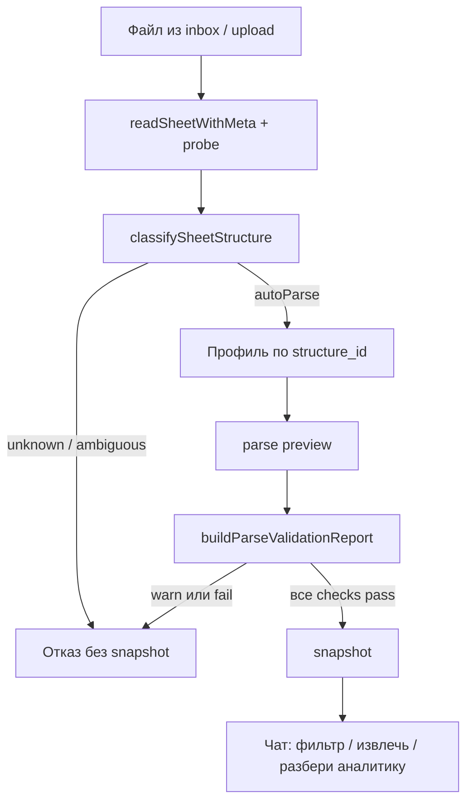
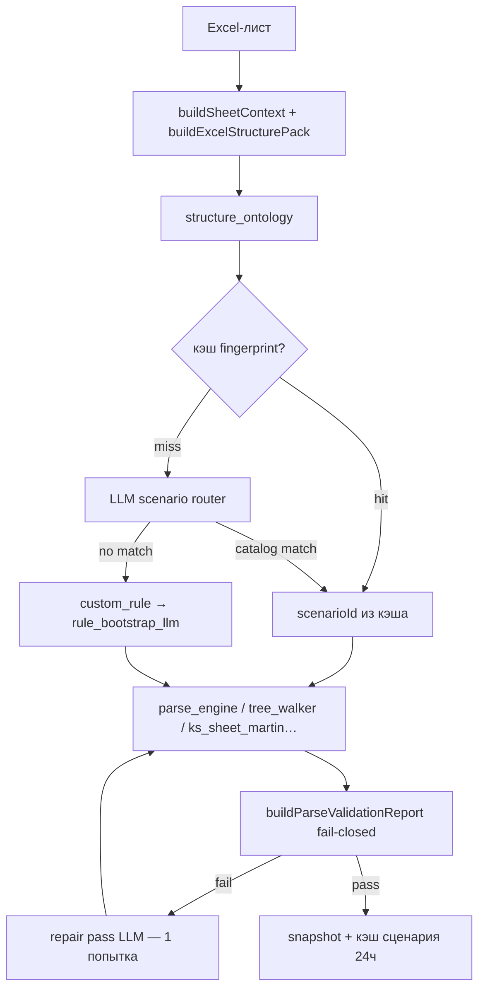

# Сценарии парсинга и логика определения формата

Документ для разработчиков и аудиторов: **какие форматы мы понимаем**, **как выбираем парсер**, **как выглядит таблица на выходе** и **по каким признакам это определяем**.

См. также: [маршрутизация агентов](parser-routing.md) (Антон / Любовь / Павел / Ксения).

---

## 1. Два уровня: профиль куратора и сценарий парсинга

| Уровень | Что это | Примеры |
|--------|---------|---------|
| **Профиль куратора** | Кто «владеет» UI и API | `anton` (Martin, ОС/УК), `lyubov` (ОПИФ), `pavel` (нетиповые Excel/PDF) |
| **Сценарий парсинга** | Как именно разобрать файл/лист | `uk_card`, `ks_card_composite_raw`, `opif_broker`, `upd_ediweb` |

Один Excel-файл может дать **несколько вкладок** — на каждую вкладку оркестратор выбирает свой сценарий отдельно.

**Один чат — несколько результатов:** каждый успешный парс → snapshot → **вкладка** в правой панели.

---

## 2. Сколько сценариев сейчас

| Слой | Количество | Где в коде |
|------|------------|------------|
| **Каталог** (`scenarios/catalog.js`) | **14** | Стабильные `scenarioId` с правилами и движком |
| **Подтипы оркестратора** | **+6** | Профили Martin, не все дублируются в каталоге |
| **Итого маршрутов парса** | **~20** | С учётом КС flat/raw, выручки, PDF fallback |

### 2.1. Полная сводная таблица

| # | scenarioId | Название | Вход (тип файла) | Как определяем | Таблица на выходе (главные колонки) | Движок | Профиль оркестратора |
|---|------------|----------|------------------|----------------|-------------------------------------|--------|----------------------|
| 1 | `uk_card` | Карточка УК 58.01 | Excel, лист `TDSheet` и аналоги | `structure_id=uk_journal_58`: журнал 1С + **БУ** со счётом `58.01*` + парная строка **Кол.** | `period`, `document`, `operation_type`, `name`, `regNum`, `amount`, `quantity`, `debit_account`, `credit_account` — **БУ и Кол. в одной строке** | `parse_engine` | `uk_card` (приоритет 102) |
| 2 | `uk_osv_58` | ОСВ УК 58.01 (дерево) | Excel, заголовок «Оборотно-сальдовая… 58» | `structure_id=uk_osv_58`: дерево (outline), блок «Показатели», **БУ/Кол. в шапке колонок**, не в строках | Иерархия `Фонд / Счёт / Наименование / Валюта` + меры `период / Дебет\|Кредит / БУ\|Кол.` | `uk_osv_martin` | `uk_osv_58` |
| 3 | `ks_card_composite_raw` | Исходная КС (журнал 1С) | Excel «Исходная КС», Wealth journal | `structure_id=journal_1c`: шапка Период+Дт/Кт, даты в col A, **нет** дерева Договор/Контрагент в col A | `Период`, `Документ`, `Аналитика Дт`, `Аналитика Кт`, `Счёт Дт`, `Сумма Дт`, `Счёт Кт`, `Сумма Кт`, `кол-во`, `Сальдо Д/К`, `Текущее сальдо` — **как в Excel** | `ks_sheet_martin` | `ks_card` |
| 4 | `ks_card_flat` | Обработанная КС | Excel «Обработанная КС» | Те же журнальные признаки, но колонки уже разнесены в файле | `period`, `document`, `counterparty`, `contract`, `debit_account`, `debit_amount`, `credit_account`, `quantity`, … | `ks_sheet_martin` | `ks_card` |
| 5 | `os_76_account_card` | Карточка счёта 76 | Excel ОСВ/карточка 76 | `structure_id=tree_account_76`: col A «Договор N» + «Контрагент N» + счета 76, outline | `Счёт`, `Контрагент`, `Договор`, обороты/сальдо по периодам | `tree_walker` | `catalog_scenario` |
| 6 | `os_08_osv` | ОСВ 08 | Excel ОСВ по ОС | `structure_id=tree_os_08`: счета `08*` в col A, дерево подразделений/объектов | Иерархия ОС + числовые колонки сальдо/оборотов | `tree_walker` | `catalog_scenario` |
| 7 | `os_01_hierarchy` | Ведомость ОС с деревом | Excel 01, иерархия | `structure_id=hierarchy_os_01`: периоды в шапке, инв.номера, outline; **не** journal | Плоские строки с уровнями дерева + амортизация/стоимость | `tree_walker` | `catalog_scenario` |
| 8 | `os_01_flat` | Ведомость ОС плоская | Excel 01 без дерева | Тот же `hierarchy_os_01`, пользователь/план выбирает flat | Те же поля, без уровней outline | `tree_walker` | `catalog_scenario` |
| 9 | `os_01_cost_only` | ОС — только стоимость | Excel 01, урезанные колонки | Явный выбор или правило cost-only | Стоимость без полного набора амортизации | `tree_walker` | `catalog_scenario` |
| 10 | `wide_metrics` | ОС — годы в колонках | Excel wide-формат | `structure_id=wide_years`: годы `2022-начало…` в шапке | Строки ОС + колонки по годам/метрикам | `parse_engine` | `catalog_scenario` |
| 11 | `from_target` | Как в эталоне | Excel + эталон | Загружен target-файл, `infer-from-target` | Колонки как в эталоне | `target_rule_infer` | `catalog_scenario` |
| 12 | `revenue_period` | Выручка 90 (периоды) | Excel выручка / Кэсел | `structure_id=revenue_osv_90` или fingerprint: счета 90/91, блок периодов | Счёт 90 + обороты по периодам | `revenue_sheet_martin` | `revenue_period` |
| 13 | `revenue_osv_90` | ОСВ 90.01 с номенклатурой | Excel `РД_АП`, вложенная ОСВ 90 | Счета 90 в данных + иерархия групп + **БУ/Кол. в строках** показателя | `Показатель`, период, Дебет/Кредит, номенклатура | `revenue_sheet_martin` | `revenue_period` |
| 14 | `osv_flat_processed` | ОСВ плоская обработанная | Excel «Обработанная ОСВ» | `structure_id=flat_osv`: ≥4 измерения в шапке + числа | `Счёт`, `Подразделение`, `Контрагент`, `Договор`, сальдо/обороты | `osv_flat_martin` | `osv_flat_processed` |
| 15 | `card_90_tsv` | Карточка 90 (txt) | `.txt` выгрузка 1С | Имя/шапка: Период, Документ, Аналитика | Как в txt, фиксированные колонки | `parse_1c_tsv` | `scenario_router` |
| 16 | `deals_registry_tsv` | Реестр сделок (txt) | `.txt` реестр | Шапка: Дата сделки, Номер сделки, … | Строки сделок | `parse_1c_tsv` | `scenario_router` |
| 17 | `upd_ediweb` | УПД Эдивеб (PDF) | PDF УПД | `pdf_probe` → `upd_ediweb` | Позиции УПД, суммы, контрагент | `parse_upd_pdf` | `scenario_router` |
| 18 | `opif_depo` | ОПИФ — ДЕПО | PDF выписка | Папка DEPO + PDF + фраза «депо» | Операции депозитария | `parse_depo` | inbox / batch |
| 19 | `opif_broker` | ОПИФ — брокер 1.2 | Excel `1F018_*` | Имя файла с префиксом + probe `opif_broker` | Сделки брокера, merge в одну таблицу | `parse_broker` | inbox / batch |
| 20 | `broker_pdf` | Брокерский отчёт (PDF) | PDF Атон и аналоги | `pdf_probe` → `broker_report` + `broker_subtype`; имя `client_*_to_*` | Несколько вкладок по разделам (активы, ЦБ, сделки) или одна по фразе в чате | `pdf_broker_sections` / `aton_broker_extract` | Martin inbox |
| 21 | `unknown_pdf` | PDF не распознан | Прочие PDF | Низкая уверенность probe | LLM synth / ручное правило | `pdf_rule_engine` | fallback |

**Fixtures для проверки:**

| Файл | Ожидаемый сценарий |
|------|-------------------|
| `карт 58.1_HP.xlsx` / `fixtures/uk_card_581.xlsx` | `uk_card` |
| `server/fixtures/broker_aton/client_24951000_01.10.2025_to_31.10.2025.pdf` | `broker_pdf` (3 вкладки: активы, ЦБ, сделки) |
| `server/fixtures/broker_aton/client_24940000_01.12.2025_to_31.12.2025.pdf` | `broker_pdf` (активы + обременённые) |
| `fixtures/uk_card_mechel.xlsx` | `uk_card` (БУ 1083.5 + Кол. 10 в одной строке) |
| `fixtures/tricky/journal/card_76_07_6.xlsx` | `journal_1c` → `ks_card_composite_raw` |
| `docs/Павел/Выручка.xlsx` лист `РД_АП` | `revenue_osv_90` |

---

## 3. Работа в чате: хранилище → выбор → парс

### 3.1. Inbox-first (текущий UX)

| Шаг | Где | Что происходит |
|-----|-----|----------------|
| 1 | **Слева «Хранилище»** | Загрузка папки/файлов на диск сервера (`project_inbox.js`, `workspace/`) |
| 2 | **📎 в чате** | Проводник: клик — выбор, двойной клик — войти в папку, кнопка **Выбрать** |
| 3 | Enter / **Парсить** | `POST /projects/:id/inbox/parse` — парс с диска, не из браузера |
| 4 | Результат | snapshot → вкладка таблицы + сообщение Martin |

**Важно:** если файл выбран через 📎 (`pathScope`), сценарные фильтры OPIF (только `1F018_*`) **не применяются** — парсим ровно выбранный файл/папку.

### 3.2. Parse plan (`server/orchestrator/parse_plan.js`)

План строится из фразы аудитора + probe. Примеры:

| Фраза | План |
|-------|------|
| «брокер 1F018» | `opif_broker`, prefix `1F018_`, merge (только Excel) |
| «брокерский отчёт Атон» / `client_*_to_*.pdf` | `broker_pdf`, universal PDF, multiSheet по разделам |
| «исполненные сделки» / «зарезервированные ЦБ» / «все таблицы» | `broker_pdf`, один или все разделы ATON |
| «депо» | `opif_depo`, PDF из папки DEPO / выписка |
| «разбери карточку 76» | `parse_sheet` → `journal_1c` / `os_76_account_card` |
| *(Enter без текста, файл выбран в 📎)* | авто по `structure_id` листа |

**API:** `POST /parse/plan-preview`, `POST /parse/batch-start`, `POST /projects/:id/inbox/parse`.

### 3.3. Что **не** делаем при выборе Excel Martin

- Не выбираем сценарий по **имени файла** (только структура листа).
- Имя файла **участвует** в OPIF: префикс `1F018_`, `1F008_`.
- Не режем многострочную аналитику на парсе — это **обогащение** после (`expand_ks_analytics`).

---

## 4. Общий поток (Excel через Martin)

### 4.1. Классический поток (classifier-only, `MARTIN_LLM_ROUTER=0`)



### 4.2. LLM-router (по умолчанию, `MARTIN_LLM_ROUTER=1`)

На **каждый Excel-лист** Martin/inbox — сначала structure pack + онтология, затем LLM выбирает `scenarioId` из закрытого списка. Цифры считает только движок; LLM не трогает суммы.



| Этап | Модуль | Что делает |
|------|--------|------------|
| Онтология | `structure_ontology.js` | `layout_type`, `row_pattern`, `account_signals` — форма таблицы, не имена колонок |
| Structure pack | `universal_parse/structure_pack.js` | `ontology`, `classifier_ranked`, `uk_probe`, `scenario_catalog`, `preview_rows` |
| Router | `orchestrator/scenario_router_llm.js` | Закрытый список `scenarioId`, кэш по fingerprint |
| Tie-break | `applyOntologyTieBreak` | `bu_kol_pairs` + `bu58≥2` → `uk_card`, не `journal_1c` |
| Synth | `rule_bootstrap_llm.js` | `custom_rule` или провал валидации → synth/repair правило v2 |
| Flag | `MARTIN_LLM_ROUTER` | `1` (default) — router on; `0` — откат на classifier-only |

**Вне scope LLM-router:** OPIF batch (`opif_broker`/`opif_depo`), txt, PDF — без router на каждый файл.

**Ключевой принцип:**

1. **Парс** — снять таблицу **как в файле** (для УК 58: склеить пару БУ+Кол. в одну строку).
2. **Обогащение** — отдельный шаг: «разбери аналитику», фильтры, extract.

Пороги: `MIN_AUTO_CONFIDENCE = 0.85`. При `MARTIN_LLM_ROUTER=1` **ambiguous не блокер** — лист уходит в LLM-router. При `MARTIN_LLM_ROUTER=0` gap top1−top2 < 0.12 → отказ (кроме tie-break `uk_journal_58`).

---

## 5. Классификация структуры (`structure_classifier.js`)

`classifySheetStructure` → `structure_id`, `confidence`, `autoParse`, `profileId`.

| structure_id | Признаки определения (без имени файла) | → Профиль оркестратора | → Сценарий |
|--------------|----------------------------------------|------------------------|------------|
| `uk_journal_58` | Журнал 1С (шапка, даты col A, Дт/Кт) **+** строки **БУ** со счётом `58.01*` и парные **Кол.** | `uk_card` | `uk_card` |
| `uk_osv_58` | Заголовок ОСВ 58, дерево, «Показатели», wide-колонки БУ/Кол. | `uk_osv_58` | `uk_osv_58` |
| `journal_1c` | Шапка + col0 = даты + блок Дт/Кт; **нет** дерева Договор/Контрагент в col A | `ks_card` | `ks_card_composite_raw` / `ks_card_flat` |
| `tree_account_76` | col A: «Договор N» + «Контрагент N» + счета 76 | `catalog_scenario` | `os_76_account_card` |
| `tree_os_08` | col A: счёт `08*`, outline | `catalog_scenario` | `os_08_osv` |
| `hierarchy_os_01` | Периоды в шапке + ОС/инв.номер; не journal | `catalog_scenario` | `os_01_*` |
| `revenue_osv_90` | Счета 90.xx + блок периодов; не journal | `revenue_period` | `revenue_osv_90` / `revenue_period` |
| `flat_osv` | ≥4 измерения в шапке + числа | `osv_flat_processed` | `osv_flat_processed` |
| `wide_years` | Годы в колонках шапки | `catalog_scenario` | `wide_metrics` |
| `instruction` / `workpaper` | Текст инструкции / рабочая документация | — | skip |
| `unknown` | Не подошло | — | **отказ** |

### 5.1. Детально: как отличаем `uk_journal_58` от `journal_1c`

**Правило выбора парсера `uk_card` (детерминизм, до LLM):**

| # | Сигнал | Где в коде |
|---|--------|------------|
| 1 | `row_pattern=bu_kol_pairs` | `structure_ontology.js` |
| 2 | `account_signals.bu58 >= 2` (строки БУ со счётом 58.01) | `layout_fingerprint.detectUkStructure` |
| 3 | `account_signals.kol_rows >= 2` (парные строки Кол.) | то же |
| 4 | Шапка: **Показатель** + **Текущее сальдо** (буст +0.02) | `detectUkJournalStructure` |
| 5 | `balance_signals.has_balance_pairs` — сальдо на БУ и Кол. | `structure_ontology.detectBalanceSignals` |
| 6 | Tie-break: `uk_journal_58` > `journal_1c` при п.1–2 | `applyOntologyTieBreak` |
| 7 | `parser_rule.scenarioId=uk_card` в ontology | `resolveScenarioFromOntology` → router fallback |

**LLM-router** (`MARTIN_LLM_ROUTER=1`): на каждый лист смотрит `ontology.parser_rule` и `classifier_ranked`; при `bu_kol_pairs` **не** уходит в `ks_card_composite_raw`, даже если journal score выше.

Оба — журнал 1С с датами. Различие:

| Признак | `journal_1c` (КС) | `uk_journal_58` (карточка 58) |
|---------|-------------------|-------------------------------|
| Показатель | Обычно нет колонки БУ/Кол. в строках | Колонка **Показатель**: чередование **БУ** / **Кол.** |
| Счёт дебета | Любые счета (76, 91, …) | Строки **БУ** со счётом **`58.01*`** |
| Выход парсера | Composite raw или flat КС | `uk_card`: `amount` + `quantity` **в одной строке** |
| Пример | Wealth `card_76_07_6.xlsx` | `карт 58.1_HP.xlsx`, `uk_card_mechel.xlsx` |

**Тай-брейк (важно):** если в листе есть шапка журнала (`headerRow`, `dtKt=true`, много дат) **и** пары БУ/Кол. по 58.01 — побеждает **`uk_journal_58`**, не `journal_1c`. Иначе типовая карточка 58 с `headerRow=7 dates=50` ошибочно помечалась «неоднозначной» и парс отказывался.

Код: `detectUkJournalStructure()` + `rules/examples/uk_card.json` (`multi_row` по показателю `Кол.`).

---

## 6. Оркестратор листа Excel (`sheet_parse_orchestrator.js`)

Профили (`SHEET_PARSE_PROFILES`), по убыванию приоритета detect-score:

| ID профиля | Приоритет | Когда | Модуль |
|------------|-----------|-------|--------|
| `uk_card` | 102 | `structure_id=uk_journal_58` или `profile_hint=uk_card` | `parse_engine` + `uk_card.json` |
| `ks_card` | 100 | `structure_id=journal_1c` | `ks_sheet_martin.js` |
| `uk_osv_58` | 99 | `structure_id=uk_osv_58` | `uk_osv_martin.js` |
| `revenue_period` | 98 | `structure_id=revenue_osv_90` | `revenue_sheet_martin.js` |
| `osv_flat_processed` | 90 | `structure_id=flat_osv` | `osv_flat_martin.js` |
| `catalog_scenario` | 50 | Деревья ОС, wide, from_target | `scenarios/` + `parse_engine` / `tree_walker` |

После парса — `buildParseValidationReport`. Любой `warn` или `fail` → snapshot откатывается.

### 6.1. Отчёт валидации (`parse_validation_report.js`)

| check id | Когда | Что проверяем |
|----------|-------|---------------|
| `row_count` | всегда | ≥1 строка (audit: <3 = warn = отказ) |
| `scenario_alignment` | всегда | scenarioId из ALLOWED_SCENARIOS для structure_id |
| `uk_card_headers` | `uk_journal_58` + `uk_card` | period/document/debit/credit в preview |
| `journal_headers` | `journal_1c` или `uk_journal_58` + КС-сценарий | Период / Документ / Дт/Кт |
| `probe_dates` | journal-структуры | даты probe ↔ колонка Период в preview |
| `tree76_*` | карточка 76 | Контрагент, заголовки |
| `os01_*` | ОС 01 | не путать с датой / 90.xx |
| `target_*` | есть эталон | ≥50% совпадения колонок/строк |

---

## 7. Детальные сценарии: вход → выход

### 7.1. `uk_card` — карточка УК 58.01

**Типичный вход (Excel):**

```
Строки 1–6: шапка «Карточка счета 58.01», период, валюта
Строки 7–8: Период | Документ | Аналитика Дт | Аналитика Кт | Показатель | Дебет | | Кредит | | Текущее сальдо
Данные парами:
  29.12.2024 | Сделка с ц/б... | Мечел, ап... | ООО СБ-Брокер... | БУ  | 58.01.4 | 1 083,50 | 76.07.2 | ...
  (пусто)    |               |              |                  | Кол.|         | 10,0     |         | ...
```

**Как определяем:**

1. `structure_ontology` → `row_pattern=bu_kol_pairs`, `suggested_scenario=uk_card`.
2. LLM-router (`MARTIN_LLM_ROUTER=1`) или `classifySheetStructure` → `uk_journal_58`.
3. Профиль `uk_card` (не `ks_card` — тот для Wealth/КС без паттерна 58).
4. `uk_layout_probe` v2: все роли колонок по семантике данных (period, debit, amount, …).
5. `layout_fingerprint`: даты col A + БУ/Кол.

**Таблица на выходе (одна логическая операция = одна строка):**

| Колонка | Содержимое |
|---------|------------|
| `period` | Дата из строки БУ |
| `document` | Текст документа (сделка, переоценка, …) |
| `operation_type` | Тип операции из document |
| `name` | Ценная бумага из аналитики Дт |
| `regNum` | Рег. номер из аналитики |
| `amount` | Сумма из строки **БУ** |
| `quantity` | Количество из следующей строки **Кол.** |
| `current_balance_bu` | Текущее сальдо **БУ** (денежное) |
| `current_balance_qty` | Текущее сальдо **Кол.** (количественное) |
| `debit_account` | Счёт дебета (58.01.4, …) |
| `credit_account` | Счёт кредита (76.07.2, 91.01.10, …) |

**Правило:** `server/rules/examples/uk_card.json` — `skip_rows: 7`, `multi_row.indicator_value: "Кол."`.

---

### 7.2. `uk_osv_58` — ОСВ УК с деревом

**Вход:** ОСВ по счёту 58, дерево Excel (outline), в шапке периоды, под ними Дебет/Кредит, под ними **БУ** и **Кол.** — как **колонки**, не строки.

**Выход:** wide-таблица `Фонд / Счёт / Наименование / Валюта / {период / Дебет|Кредит / БУ|Кол.}`.

**Отличие от `uk_card`:** в карточке БУ/Кол. — **строки** (склеиваем); в ОСВ — **колонки** (pivot уже в шапке).

---

### 7.3. `ks_card` — журнал / Исходная КС

**Вход:** Период, Документ, Аналитика Дт/Кт (многострочная в ячейках), Дебет/Кредит.

| Подтип | Когда | Выход |
|--------|-------|-------|
| `ks_card_composite_raw` | Исходная выгрузка, аналитика в ячейках | Колонки **как в Excel**, включая `Сальдо Д/К` |
| `ks_card_flat` | Обработанная КС, колонки разнесены | Плоские `counterparty`, `contract`, … |

**Обогащение:** «разбери аналитику» → `expand_ks_analytics`.

---

### 7.4. Каталог `scenarios/catalog.js` (14 сценариев)

| scenarioId | layout | Дерево | minConfidence |
|------------|--------|--------|---------------|
| `uk_card` | fixed_columns | нет | 0.88 |
| `uk_osv_58` | hierarchy_rows | да | 0.90 |
| `os_76_account_card` | hierarchy_osv | да | 0.90 |
| `os_08_osv` | hierarchy_osv | да | 0.85 |
| `os_01_hierarchy` | hierarchy_rows | спросить | 0.70 |
| `os_01_flat` | hierarchy_rows | нет | 0.70 |
| `os_01_cost_only` | hierarchy_rows | спросить | 0.70 |
| `wide_metrics` | wide_metrics | нет | 0.85 |
| `from_target` | — | нет | 1.0 |
| `card_90_tsv` | fixed_columns | нет | 1.0 |
| `deals_registry_tsv` | fixed_columns | нет | 1.0 |
| `upd_ediweb` | fixed_rows | нет | 0.85 |
| `opif_depo` | fixed_rows | нет | 1.0 |
| `opif_broker` | fixed_rows | нет | 1.0 |

---

## 8. Fingerprint (`layout_fingerprint.js`)

Скан первых ~120 строк, col A, шапка. Сигналы → `profile_hint`:

| Сигнал в данных | profile_hint | structure_id (обычно) |
|-----------------|--------------|------------------------|
| Даты col A + **БУ**/`58.01` + **Кол.** в строках | `uk_card` | `uk_journal_58` |
| ОСВ 58 + Показатели + wide БУ/Кол. | `uk_osv_58` | `uk_osv_58` |
| Период + Дебет/Кредит, даты, без дерева 76 | `ks_card` | `journal_1c` |
| «Договор N» + «Контрагент N» | `os_account_card_76` | `tree_account_76` |
| Счета `08*` в col A | `os_osv_08` | `tree_os_08` |
| Годы `2022-начало…` в шапке | `os_wide_years` | `wide_years` |
| Счета 90 + периоды, без ОС-инвентаря | `revenue_period` | `revenue_osv_90` |
| ≥4 измерения + числа | `osv_flat_processed` | `flat_osv` |
| Периоды + инв.номера + outline | `os_depreciation_01` | `hierarchy_os_01` |

Текстовый буст (+0.06): имя файла/листа (`выруч`, `кс`, `08`, `76`, `карт`, `58.01`).

---

## 9. Текст, PDF, ОПИФ

### 9.1. Текст 1С (`parse_1c_tsv.js`)

| scenarioId | Шапка входа | Выход |
|------------|-------------|-------|
| `card_90_tsv` | Период, Документ, Аналитика, счета | Фиксированные колонки карточки 90 |
| `deals_registry_tsv` | Дата сделки, Номер, … | Реестр сделок |

### 9.2. PDF (`universal_parse/`)

| probe kind | scenarioId | Выход |
|------------|------------|-------|
| `upd_ediweb` | `upd_ediweb` | Строки УПД |
| `depo` | `opif_depo` | ОПИФ депозитарий (только intent + сильные маркеры) |
| `broker_report` | `broker_pdf` | MultiSheet по разделам (`pdf_broker_sections` + `aton_broker_extract` для ATON) |
| прочее | `unknown_pdf` / LLM synth | По правилу |

**Брокерский PDF — подтипы (`broker_subtype` в `pdf_probe.js`):**

| subtype | Детект | Парсер | Статус |
|---------|--------|--------|--------|
| `aton` | `client_*_to_*`, ATON/АТОН в тексте | `pdf_section_table_extract` → pdfjs grid (заголовки из PDF) → кэш layout → vision structure → regex | готово |
| `vtb` | `ClnBIS_Period_*`, папка ВТБ/ГПБ | LLM rule / TBD | P1 |
| `liman` | `Account Statement_LMC-*` | TBD | P1 |
| `not_broker` | протоколы собраний | не `broker_pdf` | skip |

Инвентарь PDF проекта SOLAR: `docs/ksenia/BROKER_PDF_INVENTORY.md` (скрипт `server/scripts/audit_broker_pdfs.js`).

Фразы в чате для выбора раздела ATON: «исполненные сделки», «обременённые», «зарезервированные», «стоимость активов», «все таблицы».

**Лестница извлечения ATON (на раздел):** **pdf_parse_scenarios (БД, v3)** → pdfjs grid с адаптивным `xTol` → vision structure (только headers) → hot-cache `rule_cache` → regex `aton_broker_extract`. Модули: `resolve_pdf_parse_scenario.js`, `pdf_parse_scenario_store.js`, `pdf_section_table_extract.js`, `pdfjs_table_grid_extract.js`.

**Память сценариев PDF (v3):** таблица `pdf_parse_scenarios`, формат `rule_schema_version: 3` (координаты `center_norm`, описание полей, якоря раздела). При загрузке API возвращает `scenarioResolution`: `builtin` | `found` | `similar` | `missing`. Редактор колонок: `POST /api/pdf-grid-preview`, `POST /api/pdf-grid-extract`, сохранение `POST /api/pdf-parse-scenarios/from-extract`. Импорт из `rule_cache.json`: `node server/scripts/migrate_rule_cache_to_pdf_scenarios.js`.

**Папка PDF (inbox 📎):** для `broker_pdf` каждый файл × раздел → отдельная вкладка (не merge в одну таблицу с `source_file`). Прочие PDF по-прежнему могут сливаться в одну таблицу.

### 9.3. ОПИФ (Любовь, inbox)

| scenarioId | Фильтр файлов | Merge |
|------------|---------------|-------|
| `opif_broker` | `1F018_*` (или из фразы) | Одна таблица |
| `opif_depo` | PDF в папке DEPO | Одна таблица |

Запуск: хранилище → 📎 (или вся папка broker) → «брокер 1F018» / Enter.

---

## После парса: операции над таблицей (snapshot-path)

Все мутации таблицы идут через **snapshot** → `POST /api/parse/snapshots/:id/apply-operation`. Preview-path (`/ai/result-table-action`) — только fallback для extract/classify/filter на превью; `replace_values`, `expand_ks_analytics`, move/rename/add/undo требуют snapshot (`needsSnapshot: true`).

| Команда | action | Что делает |
|---------|--------|------------|
| «убери пустые Контрагент» | `filter_rows` | Фильтр строк в БД |
| «сделай новую таблицу …» | `split_to_table` | Копия в новый snapshot |
| «вытащи номер из Контрагент» | `extract` | Новая колонка |
| «удали колонку Группа» | `delete_column` | Убрать колонку |
| **«разбери аналитику»** | `expand_ks_analytics` | КС composite → плоские колонки |
| «перенеси колонку X после Y» | `move_column` | Порядок колонок |
| «переименуй колонку A в B» | `rename_column` | Переименование |
| «добавь колонку Комментарий» | `add_column` | Пустая колонка |
| «скопируй колонку X как Y» | `duplicate_column` | Дубликат значений |
| «отмени последнее» | `undo_last` | Откат filter_rows / delete_column (v1) |

---

## 11. Файлы в коде (шпаргалка)

| Файл | Роль |
|------|------|
| `server/scenarios/catalog.js` | **14 сценариев** каталога |
| `server/structure_classifier.js` | `structure_id`, `STRUCTURE_TO_PROFILE` |
| `server/structure_ontology.js` | Онтология листа: `row_pattern`, tie-break uk_card |
| `server/universal_parse/structure_pack.js` | `buildExcelStructurePack` для LLM-router |
| `server/orchestrator/scenario_router_llm.js` | LLM-router: pack → scenarioId |
| `server/ai_prompts_scenario_router.js` | System prompt router, закрытый список id |
| `server/sheet_parse_orchestrator.js` | Профили оркестратора, fail-closed, router hook |
| `server/parse_validation_report.js` | Checks probe ↔ preview |
| `server/layout_fingerprint.js` | Fingerprint, `profile_hint` |
| `server/project_inbox.js` | Хранилище, parse с диска |
| `server/rules/examples/uk_card.json` | Правило БУ+Кол. → одна строка |
| `server/ks_sheet_martin.js` | КС / composite / expand |
| `server/uk_osv_martin.js` | ОСВ УК 58 wide |
| `server/opif_martin.js` | OPIF batch, prefix filter |
| `server/fixtures/manifest.json` | Ожидаемые сценарии на fixtures |

---

## 12. Что добавлять дальше

1. **Новый стабильный формат** → профиль в `SHEET_PARSE_PROFILES` + fixture + строка в таблицу §2.1.
2. **Вариант того же семейства** → расширить detect, не резать ячейки на парсе.
3. **Нетиповой Excel** → Павел + LLM synth.
4. **Документация** → при новом `scenarioId` обновлять этот файл и `fixtures/manifest.json`.

---

*Актуально на код в репозитории `auditor_3` (июнь 2026). Профиль `uk_card` для `uk_journal_58` — приоритет 102, валидация `uk_card_headers`.*
