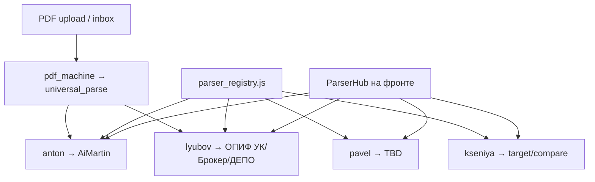

# Маршрутизация парсеров и агентов

## Идея

У каждого «куратора» свой формат, свой скрипт и свой Cursor-агент. Сначала задачи решаются **изолированно**, общий роутер только направляет.



## Профили

| ID | Имя | Статус | Движки | UI |
|----|-----|--------|--------|-----|
| `anton` | Антон | ready | parse_engine v2, snapshots | `AiMartin.jsx` |
| `lyubov` | Любовь | ready | parse_uk, broker, depo, audit | `App.jsx` ОПИФ |
| `pavel` | Павел | planned | TBD | заглушка |
| `kseniya` | Ксения | planned | target_rule_infer, compare | заглушка + target в Martin |

## Реестры

- Фронт: [`src/parserProfiles.js`](../src/parserProfiles.js)
- Бэк: [`server/parser_registry.js`](../server/parser_registry.js)
- API: `GET /api/parser-profiles`, `GET /api/parser-profiles/:id`, `POST /api/parser-dispatch`

## Cursor-агенты

| Агент | Файл |
|-------|------|
| anton | `.cursor/agents/anton.md` |
| lyubov | `.cursor/agents/lyubov.md` |
| pavel | `.cursor/agents/pavel.md` |
| kseniya | `.cursor/agents/kseniya.md` |
| pdf_machine | `.cursor/agents/pdf_machine.md` |

Вызов в чате: `Use the anton subagent to ...` / `Use the pdf_machine subagent to ...`

**pdf_machine** — Cursor-агент для разработки PDF-парсеров (probe → extract → тест). Не UI-профиль в `parser_registry.js`; результат уходит в snapshots (Martin) или `trades` (ОПИФ DEPO).

## Будущий единый dispatch

```json
POST /api/parser-dispatch
{ "profileId": "anton", "action": "start", "files": [...] }
```

Ответ — `profile.endpoints` и метаданные движка. Пока каждый профиль вызывает свои эндпоинты напрямую с фронта.

## Разделение данных

| Профиль | Хранилище |
|---------|-----------|
| Антон | `parse_snapshots`, `parsed_rows` (JSONB) |
| Любовь | `trades` (UK/Broker/DEPO) |
| Павел | TBD (вероятно отдельная таблица records) |
| Ксения | снимки Антона + target в памяти/файле |

Не смешивать `trades` и `parsed_rows` без явного ETL.
