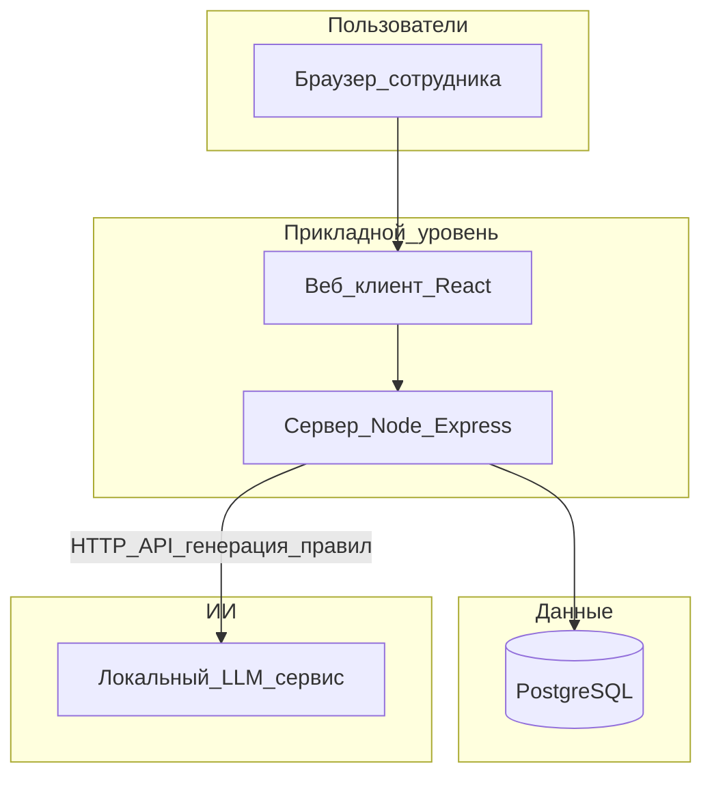

# Приложение № 5
## Архитектура системы «ИИ-Аудитор» v1 (локальное развёртывание)

Назначение документа: описание состава компонентов и потоков данных для согласования с ИТ-службой и службой информационной безопасности Заказчика.

---

### 1. Общая схема

Система работает целиком в контуре Заказчика (корпоративная сеть или выделенный сегмент). Пользователь обращается к веб-интерфейсу по HTTPS (или HTTP во внутренней сети — по политике Заказчика).



Текстовое представление архитектурных слоёв (для печати и согласования):

```text
┌─────────────────────────────────────────────────────┐
│                    ФРОНТЕНД                         │
│  React + Vite                                       │
│  • Чат с AI Martin                                  │
│  • Загрузка файлов + предпросмотр                   │
│  • Таблицы данных (поиск, фильтры, пагинация)       │
│  • Результаты аудита                                │
│  • Экспорт (CSV, Excel)                             │
└───────────────────────┬─────────────────────────────┘
                        │ REST API
┌───────────────────────┴─────────────────────────────┐
│                     БЭКЕНД                          │
│  Node.js + Express                                  │
│  • API проектов, данных, аудита                     │
│  • Движок парсинга (настраиваемый правилами)        │
│  • Движок аудита (настраиваемый правилами)          │
│  • AI-оркестратор (общается с LLM, вызывает         │
│    инструменты: парсинг, запросы, аудит)            │
│  • Менеджер коннекторов к внешним БД                │
└───────────────────────┬─────────────────────────────┘
                        │
┌───────────────────────┴─────────────────────────────┐
│                   ХРАНИЛИЩЕ                         │
│  • PostgreSQL — данные, правила, результаты, чат    │
│  • Файловое хранилище — загруженные файлы           │
└─────────────────────────────────────────────────────┘
                        │
┌───────────────────────┴─────────────────────────────┐
│                ЯЗЫКОВАЯ МОДЕЛЬ                      │
│  Локальная open-source LLM (runtime в контуре)      │
│  • Понимание задачи пользователя                    │
│  • Генерация правил парсинга                        │
│  • Генерация правил аудита                          │
│  • Ответы на вопросы по данным                      │
└─────────────────────────────────────────────────────┘
```

---

### 2. Компоненты

#### 2.1. Веб-клиент

- Технологии: HTML/CSS/JavaScript, фреймворк React, сборка Vite
- Функции: вкладки источников данных (УК, брокер, ДЕПО), загрузка файлов, поиск, экспорт CSV; вкладка настройки парсинга с участием ИИ; вкладка запуска аудита и просмотра результатов
- Взаимодействие: HTTP(S) к API серверной части (JSON, multipart при загрузке файлов)

#### 2.2. Сервер приложения

- Технологии: Node.js, фреймворк Express
- Функции:
  - приём и сохранение загруженных файлов во временное хранилище/память для обработки
  - парсинг Excel (карточка счёта УК, отчёты брокера) и PDF (выписки ДЕПО)
  - нормализация записей и запись в PostgreSQL
  - эндпоинты превью и полного аудита (сверка записей между источниками по согласованным правилам)
  - запрос к локальному LLM: передача фрагмента превью таблицы (ограниченное число строк) и текста запроса пользователя; получение JSON-правила для умного парсера УК
- Развёртывание: постоянный процесс (системный сервис), настройка через переменные окружения

#### 2.3. База данных

- СУБД: PostgreSQL
- Назначение: хранение нормализованных сделок с указанием источника (УК / брокер / ДЕПО), вспомогательные сущности (проекты, сохранённые правила парсинга — по фактической схеме поставки)

#### 2.4. Локальный сервис языковой модели (LLM)

- Назначение: генерация структурированного JSON по промпту и превью данных (настройка парсинга УК без ручного программирования под каждый вариант выгрузки)
- Развёртывание: отдельный процесс на сервере с GPU не менее 16 ГБ VRAM (базовый ориентир для выбранной модели и запаса под пиковую нагрузку); для работы модуля ИИ GPU обязателен
- Доступ: только из внутренней сети, без выхода в публичный интернет для обработки данных Заказчика

#### 2.5. Опционально: обратный прокси

- Nginx, IIS или аналог: TLS-терминация, единая точка входа, ограничение доступа по IP/VPN

---

### 3. Поток данных (упрощённо)

1. Пользователь загружает файлы -> сервер парсит -> записи попадают в PostgreSQL.
2. При нестандартном УК: пользователь формулирует запрос -> сервер отправляет превью + запрос в LLM -> получает JSON-правило -> применяет умный парсер -> записи УК в БД.
3. Пользователь запускает аудит -> сервер читает данные из БД, выполняет сверку -> возвращает таблицу результатов -> пользователь фильтрует и выгружает CSV.

---

### 4. Границы доверия и данные

- Персональные и коммерчески значимые данные обрабатываются на площадке Заказчика
- В LLM передаётся ограниченный фрагмент файла (превью), а не обязательно полный документ; полный файл остаётся на сервере приложения на время обработки согласно политике хранения Заказчика
- Резервное копирование: база PostgreSQL и при необходимости конфигурационные файлы — по регламенту Заказчика

---

### 5. Версия

Документ описывает версию 1 поставки. Расширение (SSO, очереди, микросервисы) оформляется отдельными приложениями к договору.

---

Дата: ___________
